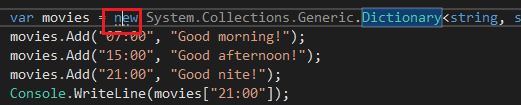
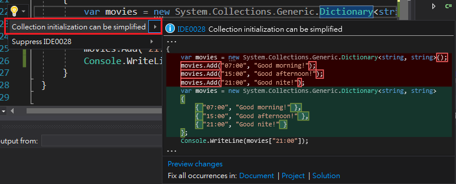

## Hot keys

* Ctrl+J : Intellisense 
* Ctrl+K, L : List members
* Ctrl+K, P: Show function parameter information

## Code Snippets

Use code snippets to append codes into editor quickly.

## Visual Studio 2017 New features
1. Collection initialization can be simplized

2.

## C# Type

1. Value
2. Reference

## Generic

System.Collections.Generic.List includes
* List<T>
* Queue<T>
* Stack<T>

> Solve the boxing-unboxing problem.

1. ArrayList as List
2. HashTable as Dictionary

